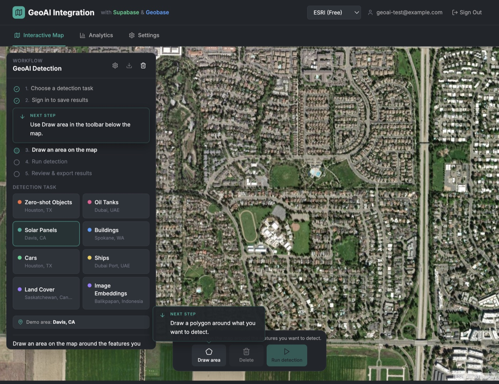

<h1 align="center">
  GeoAI.js
</h1>

<p align="center">
  <strong>Geospatial AI that runs in the browser.</strong><br/>
  Detect buildings, vehicles, ships, solar panels, and more — on satellite &amp; aerial imagery — without a GPU backend.
</p>

<p align="center">
  <a href="https://www.npmjs.com/package/geoai"></a>
  <a href="https://github.com/decision-labs/geoai.js/actions/workflows/main.yml"></a>
  <a href="https://www.npmjs.com/package/geoai"></a>
  <a href="https://docs.geobase.app/geoai"></a>
  <a href="LICENSE.md"></a>
</p>

<p align="center">
  <a href="https://docs.geobase.app/geoai-live"><strong>Live demos →</strong></a>
  ·
  <a href="https://docs.geobase.app/geoai"><strong>Docs →</strong></a>
  ·
  <a href="#agents--llms"><strong>Agent skill →</strong></a>
</p>

<div align="center">
  
</div>

<p align="center"><em>DINOv3 image feature extraction in the browser — try it at <a href="https://docs.geobase.app/geoai-live">docs.geobase.app/geoai-live</a></em></p>

---

## Why GeoAI.js?

| | |
|---|---|
| **Client-side** | Models run in the browser (WebGPU / WASM) via Transformers.js + ONNX Runtime |
| **Draw → detect** | Pass a GeoJSON polygon; get detections back as GeoJSON |
| **Your imagery** | ESRI, Mapbox, Geobase COGs, TMS, WMS, OpenAerialMap, Google Map Tiles |
| **Pipeline-ready** | Chain tasks; run inference off the main thread with workers |

```bash
npm i geoai
# peers
npm i @huggingface/transformers onnxruntime-web
```

```javascript
import { geoai } from "geoai";

const pipeline = await geoai.pipeline([{ task: "building-detection" }], {
  provider: "esri", // no API key
});

const result = await pipeline.inference({
  inputs: { polygon: myGeoJsonPolygon },
  mapSourceParams: { zoomLevel: 18 },
});
// result.detections → GeoJSON FeatureCollection
```

CDN:

```html
<script src="https://unpkg.com/geoai@1.0.7/geoai.js"></script>
<!-- or -->
<script src="https://cdn.jsdelivr.net/npm/geoai@1.0.7/geoai.min.js"></script>
```

---

## Use cases

GeoAI.js is built for product teams and researchers who need **interactive** geospatial AI — not batch jobs on a remote GPU cluster.

- **Urban inventory** — building footprints & boxes for planning, insurance, or change tracking  
- **Energy & infrastructure** — solar panels, oil storage tanks, utility assets  
- **Transport & logistics** — cars, trucks, ships in ports and yards  
- **Environment** — land cover and wetland segmentation over AOIs  
- **Exploration** — zero-shot detection and DINOv3 embeddings for similarity search  

Draw an AOI on a map, run a model, store or style the GeoJSON — all in one frontend session.

---

## Integrations

Persist detections, sync in real time, and serve results as vector tiles.

<div align="center">
  
</div>

<p align="center"><em>Full-stack demo: draw → detect → save to PostGIS (Supabase or Geobase) with live map layers</em></p>

| Stack | What you get |
|-------|----------------|
| **[Supabase](examples/04-geoai-supabase-geobase-integration)** | Auth, PostGIS storage, realtime subscriptions for detection history |
| **[Geobase](examples/04-geoai-supabase-geobase-integration)** | Same PostGIS path **plus** vector tileserver for thousands of styled detections |
| **MapLibre / React** | Live task demos and quickstarts |
| **[deck.gl](examples/deckgl-demo)** | GPU-friendly overlay workflows |
| **Agent skill** | Cursor / Claude / Codex integration via [`skills/geoai`](skills/geoai) |

Quick links:

- Example app + guide: [`examples/04-geoai-supabase-geobase-integration`](examples/04-geoai-supabase-geobase-integration)  
- Integration write-up: [`INTEGRATION_GUIDE.md`](examples/04-geoai-supabase-geobase-integration/INTEGRATION_GUIDE.md)  
- Interactive tasks: [docs.geobase.app/geoai-live](https://docs.geobase.app/geoai-live)

---

## Map providers

Point the pipeline at the imagery you already use:

| Provider | Auth | Notes |
|----------|------|--------|
| **ESRI** | None | World Imagery — great default for demos |
| **Mapbox** | Token | Satellite styles |
| **Geobase** | Project + API key | Your COG / tileserver |
| **TMS** | Optional | Any `{z}/{x}/{y}` raster URL |
| **WMS** | Usually none | OGC GetMap (e.g. NRW orthophotos) |
| **OpenAerialMap** | None | HOT Imagery STAC + TiTiler |
| **Google** | API key | Map Tiles API (session + XYZ); prefer a server proxy in browsers |

```javascript
// Free public imagery
{ provider: "esri" }

// Community aerial (OAM)
{ provider: "oam" /* , itemId, mosaic: true */ }

// Your COG on Geobase
{
  provider: "geobase",
  projectRef: "...",
  apikey: "...",
  cogImagery: "https://path-to-your-cog.tif",
}

// Google Map Tiles (enable Map Tiles API; avoid HTTP-referrer–only keys)
{ provider: "google", apiKey: process.env.GOOGLE_MAPS_API_KEY }
```

Docs: [Map providers](https://docs.geobase.app/geoai/map-providers)

---

## Supported tasks

Object detection · Building detection · Building footprint segmentation (ChangeStar) · Car · Ship · Solar panel · Oil storage tank · Oriented object detection · Land cover · Wetland · Mask generation · Zero-shot detection & segmentation · Image feature extraction (DINOv3)

→ [Full task reference](https://docs.geobase.app/geoai/supported-tasks)

---

## Workers & React

Keep the UI smooth — run inference in a **Web Worker**. Patterns for vanilla JS and React live in the skill and docs (there is no separate `geoai/react` package export; use the worker + hook examples).

- [Workers guide](https://docs.geobase.app/geoai/workers)  
- [React quickstart](https://docs.geobase.app/geoai/frontend-frameworks/react-quickstart)  
- Example: [`examples/02-quickstart-with-workers`](examples/02-quickstart-with-workers)

---

## Quickstart clone

```bash
git init
git subtree add --prefix=examples/01-quickstart \
  https://github.com/decision-labs/geoai.js main --squash
cd examples/01-quickstart && npm install && npm run dev
```

---

## Agents & LLMs

Teach coding agents how to integrate GeoAI.js:

```bash
npx skills add decision-labs/geoai.js --skill geoai -y
# or globally
npx skills add decision-labs/geoai.js --skill geoai -g -y
```

- Skill source: [`skills/geoai`](skills/geoai)  
- LLM docs index: [llms.txt](https://docs.geobase.app/geoai/llms.txt)  
- Full corpus: [llms-full.txt](https://docs.geobase.app/geoai/llms-full.txt) (`pnpm docs:llms`)

---

## Talk

**[Bringing Earth Observation AI to the Browser with WebGPU](talks/lightning-talk-webgpu-geoai.md)** — Big Data from Space 2025 (Decision Labs).

<div align="center">
  <a href="https://geobase-docs.s3.amazonaws.com/geobase-ai-assets/talks/lightning-talk-webgpu-geoai.pdf">
    
  </a>
</div>

- [Slides (PDF)](https://geobase-docs.s3.amazonaws.com/geobase-ai-assets/talks/lightning-talk-webgpu-geoai.pdf)

---

## Links

- **Docs** — [docs.geobase.app/geoai](https://docs.geobase.app/geoai)  
- **Live examples** — [docs.geobase.app/geoai-live](https://docs.geobase.app/geoai-live)  
- **npm** — [geoai](https://www.npmjs.com/package/geoai)  
- **Roadmap** — [_docs4devs/ROADMAP.md](_docs4devs/ROADMAP.md)  
- **Discussions** — [GitHub Discussions](https://github.com/decision-labs/geoai.js/discussions)  
- **Issues** — [GitHub Issues](https://github.com/decision-labs/geoai.js/issues)

## Contributing

See [CONTRIBUTING.md](CONTRIBUTING.md).

## License

MIT — [LICENSE.md](LICENSE.md)

[//]: <> (Toggle CI off)
